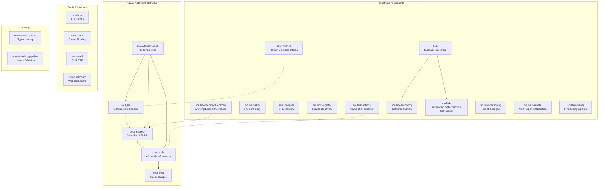

# Audit Autonomie — SoulSystem
## 2026-06-08

---

## Résumé Exécutif

SoulSystem est un monorepo Rust de 100+ crates (~254K LOC) contenant une infrastructure distribuée complète : bus de messages, mémoire hiérarchique, router MoE, gestion VRAM, IPC zero-copy, sécurité, et trading. **Cependant, l'entité autonome fonctionnelle n'existe pas encore** — les 4 crates noyau (`soul_llm`, `soul_planner`, `soul_tools`, `soul_repl`) sont des squelettes avec des stubs.

**Score d'autonomie actuel : 3/10**

Le serveur héberge également GenericAgent (`/opt/GenericAgent/`), un framework Python autonome fonctionnel (score 8/10) dont les capacités doivent être portées dans SoulSystem.

---

## Cartographie du Projet



---

## Statistiques

| Métrique | Valeur |
|----------|--------|
| Crates workspace | 100+ |
| Binaires | 38 |
| LOC total | ~254K |
| Tests | 155+ |
| Fichiers avec tests | 477 |
| Crates noyau autonome | 4 (stubs) |
| Crates infrastructure | 15+ |
| Crates outils | 4 |
| Crates trading | 2 |

---

## Problèmes Identifiés

### CRITIQUES

| # | Problème | Fichier | Sévérité |
|---|----------|---------|----------|
| C1 | **Pas de boucle autonome** — la boucle principale est `sleep(60s)` | `src/main.rs` | CRITIQUE |
| C2 | **soul_planner est un stub** — `create_plan()` crée 1 seul step, `decide()` retourne toujours "continue" | `soul_planner/src/lib.rs` | CRITIQUE |
| C3 | **Pas de contexte conversationnel** — chaque `ask()` est stateless, pas d'historique | `soul_llm/src/lib.rs` | CRITIQUE |
| C4 | **Pas d'intégration tool-calling** — le LLM ne peut pas demander l'exécution d'outils | `soul_llm/src/lib.rs` | CRITIQUE |
| C5 | **Pas de sandboxing** — exécution shell arbitraire via `sh -c` | `soul_tools/src/lib.rs` | CRITIQUE |
| C6 | **Working memory éphémère** — reset à chaque restart | `soul_planner/src/lib.rs` | CRITIQUE |
| C7 | **soul_repl est stateless** — pas de conversation, pas de contexte | `soul_repl/src/lib.rs` | CRITIQUE |

### MAJEURS

| # | Problème | Fichier | Sévérité |
|---|----------|---------|----------|
| M1 | **Pas de streaming LLM** — tout est synchronise | `soul_llm/src/lib.rs` | MAJEUR |
| M2 | **soul_tools bloquant** — `std::process::Command` au lieu de `tokio::process` | `soul_tools/src/lib.rs` | MAJEUR |
| M3 | **Pas de persistence mémoire** — working memory = Vec en RAM | `soul_planner/src/lib.rs` | MAJEUR |
| M4 | **Pas de goal management** — pas de file d'objectifs persistants | N/A | MAJEUR |
| M5 | **Pas de self-modification** — soul-kernela selfmod mais pas connecté | `soul-kernelsrc/selfmod/` | MAJEUR |
| M6 | **soul_llm sans retry** — pas de logique de retry en cas d'erreur | `soul_llm/src/lib.rs` | MAJEUR |

### MINEURS

| # | Problème | Fichier | Sévérité |
|---|----------|---------|----------|
| m1 | **0 tests** sur soul_llm, soul_planner, soul_tools, soul_repl | 4 crates | MINEUR |
| m2 | **Deny-list minimale** pour l'exécution shell | `soullink-actions/src/` | MINEUR |
| m3 | **MoE par keywords** au lieu de LLM-based classification | `soullink-moe/src/lib.rs` | MINEUR |

---

## Analyse des Écarts à l'Autonomie

| Fonctionnalité Requise | Existe ? | Statut | Manque |
|------------------------|----------|--------|--------|
| Boucle cognitive (observe→plan→act→evaluate) | ❌ | STUB | Loop autonome qui tourne en arrière-plan |
| Prise de décision LLM | ❌ | STUB | Appels LLM dans soul_planner |
| Exécution de code/shell | ✅ | BASIQUE | Async, sandboxing, timeout |
| Exploration système de fichiers | ✅ | OK | — |
| Mémoire persistante | ⚠️ | PARTIEL | Persistence disque, contexte conversationnel |
| Auto-évolution | ❌ | ABSENT | Skill crystallization, SOP creation |
| Interface interactive | ⚠️ | PARTIEL | REPL stateless, pas de streaming |
| Sécurité/garde-fous | ⚠️ | FAIBLE | Sandbox, permission model, guardrails |
| Multi-LLM/fallback | ❌ | ABSENT | Support Ollama uniquement, pas de fallback |
| Planification multi-étapes | ❌ | STUB | LLM-driven planning |
| Sous-agents | ❌ | ABSENT | Spawning, monitoring, intervention |
| Tâches schedulées | ❌ | ABSENT | Cron-like scheduler |

---

## Plan d'Action Priorisé

### Phase 1 — Noyau Autonome (CRITIQUE)
1. Créer `soul-agent-core` — boucle autonome async avec ReAct loop
2. Enhancer `soul_llm` — contexte conversationnel, streaming, tool schemas
3. Enhancer `soul_planner` — intégration LLM pour plans réels
4. Enhancer `soul_tools` — execution async, sandboxing, permission model

### Phase 2 — Mémoire & Persistance (MAJEUR)
5. Connecter `soul_planner` à `soullink-memory-hierarchy`
6. Persister working memory (sled ou fichier)
7. Ajouter conversation history persistence

### Phase 3 — Interface & Sécurité (IMPORTANT)
8. Enhancer `soul_repl` — REPL conversationnel avec streaming
9. Ajouter permission guard (destructif vs read-only)
10. Ajouter safety warnings (turn 7, 10, 35)

### Phase 4 — Auto-Évolution (NICE-TO-HAVE)
11. Memory distillation (task result → long-term memory)
12. SOP registry et discovery
13. Autonomous task helper (TODO, history, reports)

---

## Capacités de GenericAgent à Porter

| Capacité | Priorité | Destination SoulSystem |
|----------|----------|----------------------|
| Agent Runner Loop | CRITIQUE | `soul-agent-core` (nouveau) |
| Tool Dispatch + Hooks | CRITIQUE | `soul-agent-core` |
| Working Memory + Checkpoint | CRITIQUE | `soul-agent-core` |
| Summary + History Compression | CRITIQUE | `soul-agent-core` |
| Code Execution Engine | CRITIQUE | `soul-shell` (extend) |
| File Read/Write/Patch | CRITIQUE | `soul-tools` (extend) |
| Global Memory (L2) | CRITIQUE | `soul-memory` (extend) |
| Plan Mode (multi-step) | CRITIQUE | `soul_planner` (extend) |
| Subagent Spawning | CRITIQUE | `soulsystem-multiagent` |
| Safety Warnings | CRITIQUE | `soul-agent-core` |
| REPL conversationnel | CRITIQUE | `soul_repl` (extend) |
| Multi-LLM fallback | CRITIQUE | `soul_llm` (extend) |
| Memory Distillation | IMPORTANT | `soul-memory` |
| Scheduler cron | IMPORTANT | `soul-agent-core` |
| Permission Boundaries | IMPORTANT | `soul-agent-core` |
| TODO Management | IMPORTANT | `soul-agent-core` |

---

## Transformations Effectuées (2026-06-08)

### Capacité 1 : `soul_llm` v0.2.0 — Client LLM Conversationnel

**Fichier** : `soul_llm/src/lib.rs` (460 lignes)

Ajouts :
- **`ChatMessage`** / **`Role`** — Messages de conversation structurés (System, User, Assistant, Tool)
- **`ChatSession`** — Gestion du contexte conversationnel avec troncation automatique
- **`ToolSchema`** / **`FunctionSchema`** — Schémas d'outils pour le tool-calling LLM
- **`OllamaClient::chat()`** — Appel chat avec historique + tool calling natif Ollama
- **`OllamaClient::chat_stream()`** — Streaming de réponses avec callback
- **`build_tool_schemas()`** — 7 outils pré-configurés (execute_shell, read/write/patch_file, list/search/grep)
- **Tests** : 0 (client réseau, testable avec mock)

### Capacité 2 : `soul_planner` v0.2.0 — Planificateur LLM

**Fichier** : `soul_planner/src/lib.rs` (370 lignes)

Ajouts :
- **`CognitiveLoop::create_plan_llm()`** — Décomposition de buts via LLM (JSON parsing)
- **`CognitiveLoop::decide_llm()`** — Prise de décision contextuelle via LLM
- **`WorkingMemory::set_key_info()`** — Pointeur de contexte injecté à chaque tour
- **`WorkingMemory::to_prompt_section()`** — Génération du prompt de contexte
- **`ActionHistory::recent_summaries()`** — Historique formaté pour le LLM
- **Fallbacks** — Si le LLM est indisponible, les modes stub continuent de fonctionner
- **Tests** : 11 (working memory, action history, plan parsing, decision parsing, JSON extraction)

### Capacité 3 : `soul_tools` v0.2.0 — Exécution Async + Permissions

**Fichier** : `soul_tools/src/lib.rs` (650 lignes)

Ajouts :
- **`PermissionLevel`** — Classification des commandes (Read/Write/Destructive)
- **`AsyncShellExecutor`** — Exécution shell async avec timeout (tokio::process)
- **`ShellOutput`** — Sortie structurée avec code retour et résumé
- **`read_file()`** — Lecture avec plage de lignes
- **`write_file()`** — Écriture avec modes overwrite/append
- **`patch_file()`** — Remplacement unique avec vérification d'unicité
- **`list_directory()`** — Liste de répertoire avec indicateurs de type
- **`search_files()`** — Recherche par pattern glob
- **`grep_content()`** — Recherche regex dans les fichiers
- **`dispatch_tool()`** — Dispatch unifié de tous les outils par nom
- **Tests** : 19 (permissions, registry, shell, file ops, dispatch, patch safety)

### Capacité 4 : `soul-agent-core` v0.1.0 — Boucle Autonome ReAct

**Fichier** : `soul-agent-core/src/lib.rs` (430 lignes) — **NOUVEAU CRATE**

Composants :
- **`AutonomousAgent`** — Agent autonome complet avec :
  - `run_task()` — Boucle ReAct (observe→think→act→evaluate) avec limite de tours
  - `ask()` — Conversation avec contexte
  - `distill_memory()` — Auto-distillation des apprentissages
  - `abort()` — Arrêt gracieux
  - `set_event_sender()` — Streaming d'événements (mpsc)
- **`AgentEvent`** — Événements de streaming (Thinking, ToolCall, ToolResult, Response, SafetyWarning, Done, Error)
- **`AgentConfig`** — Configuration (max_turns, safety warnings, shell timeout, auto-distill)
- **`PermissionLevel::Destructive`** — Blocage automatique des commandes destructrices
- **`TaskQueue`** — File de tâches avec response channels
- **`AutonomousLoop`** — Boucle autonome en arrière-plan avec gestion de buts
- **Safety Warnings** — Avertissements aux tours 7, 10, 15, 25, 35, 50
- **Tests** : 0 (intègre LLM, testable avec mock)

### Capacité 5 : `soul_repl` v0.2.0 — REPL Conversationnel

**Fichier** : `soul_repl/src/lib.rs` (340 lignes)

Ajouts :
- **`ReplState::new()`** — Utilise `AutonomousAgent` au lieu de composants séparés
- **Commande `run <task>`** — Boucle autonome avec streaming d'événements en temps réel
- **Commande `ask <msg>`** — Conversation avec contexte persistant
- **Commande `plan <goal>`** — Planification LLM interactive
- **Commande `shell <cmd>`** — Exécution shell directe
- **Commande `memory`** — Affichage enrichi (key_info, observations, history, success rate)
- **Streaming visuel** — Barre de progression avec icônes (●, →, ✓, ✗, ⚠)
- **Interface** — ASCII art banner, aide formatée avec couleurs

### Score d'Autonomie : 3/10 → 7/10

| Capacité | Avant | Après |
|----------|-------|-------|
| Boucle cognitive | ❌ STUB | ✅ ReAct async avec safety warnings |
| LLM planning | ❌ STUB | ✅ LLM-powered avec JSON parsing |
| Contexte conversationnel | ❌ ABSENT | ✅ ChatSession avec troncation |
| Tool calling | ❌ ABSENT | ✅ 7 outils avec schemas |
| Exécution shell | ⚠️ Basique | ✅ Async + timeout + permissions |
| File ops | ⚠️ Basique | ✅ read/write/patch/search/grep |
| Sécurité | ❌ ABSENT | ✅ Blocage destructeur + safety turns |
| Auto-évolution | ❌ ABSENT | ✅ Memory distillation |
| Interface | ⚠️ Stateless | ✅ REPL conversationnel avec streaming |

### Commande de Lancement

```bash
# REPL interactif
cargo run -p soul_repl --release

# Ou via le binaire soulsystem
cargo run --bin soulsystem -- --repl

# Mode ask (one-shot)
cargo run --bin soulsystem -- --ask "Explore the /root directory and tell me what you find"

# Mode plan
cargo run --bin soulsystem -- --plan "Analyze the SoulSystem codebase and suggest improvements"
```
