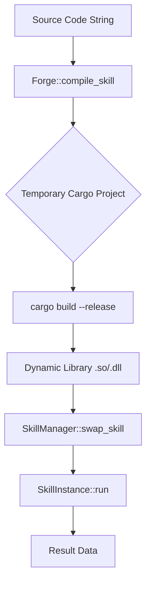

# Architecture Overview

JIT Agentic Engine is a high-performance system designed to compile and execute Rust-based "skills" on the fly. This architecture enables an agentic system to generate optimized code for specific tasks and execute it with near-native performance.

## System Components

The project is organized as a Rust workspace with several specialized crates:

### 1. `ffi_bridge`
- **Purpose**: Defines the Application Binary Interface (ABI) and shared data structures.
- **Role**: Ensures that the host (engine) and the guest (compiled skill) share a common memory layout. It defines the `SkillExecuteFn` signature and `SkillContext`.

### 2. `jit_compiler`
- **Purpose**: Orchestrates the compilation of Rust source code into dynamic libraries (`.so` or `.dll`).
- **Role**: Uses `cargo` internally to compile generated code with specific optimization flags (Thin LTO, `panic=abort`, `opt-level=3`). It handles temporary project creation and artifact management.

### 3. `dynamic_loader`
- **Purpose**: Safely loads and executes compiled dynamic libraries.
- **Role**: Uses `libloading` to map symbols from the dynamic library into the running process. It provides a `SkillManager` to handle skill swapping and execution.

### 4. `jit_demo`
- **Purpose**: Integration test and demonstration.
- **Role**: Shows the end-to-end flow: source code generation -> compilation -> loading -> execution.

## JIT Compilation Flow

1.  **Generation**: An AI agent or a system component generates Rust source code implementing a specific skill.
2.  **Forge**: The `Forge` (in `jit_compiler`) wraps this source code in a temporary Cargo project that links against `ffi_bridge`.
3.  **Compilation**: `cargo` is invoked with aggressive optimization flags.
4.  **Loading**: `dynamic_loader` loads the resulting shared library and retrieves the `skill_execute` symbol.
5.  **Execution**: The skill is executed against a zero-copy buffer, providing maximum performance.

## Optimization Strategy

To achieve Just-In-Time performance suitable for agentic workflows:
- **Thin LTO**: Provides a balance between compilation speed and runtime optimization.
- **Target CPU Native**: Compiles code specifically for the host architecture.
- **Panic Abort**: Simplifies the binary and removes unwinding overhead, which is safer for FFI boundaries.
- **Zero-Copy**: Data is passed via pointers, avoiding expensive serialization/deserialization between the host and the JIT-compiled skill.
