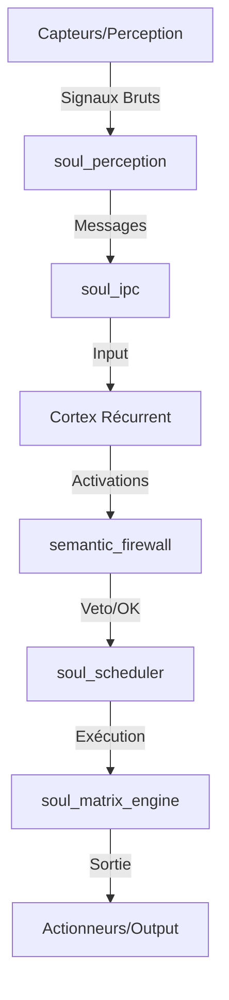

# Architecture détaillée de Soul System

Soul System est conçu comme un système d'exploitation pour agents autonomes, séparant strictement la gestion des ressources matérielles de la logique cognitive.

## 1. La Dualité du Système

Le projet est divisé en deux sous-systèmes principaux qui communiquent via des interfaces bien définies.

### A. Le Noyau Runtime (`soul_kernel`)
C'est la couche de bas niveau, équivalente au noyau d'un OS traditionnel, mais optimisée pour les charges de travail IA.

- **Gestion du Temps et des Tâches** (`soul_scheduler`) : Un ordonnanceur qui gère des milliers de micro-tâches d'agents. Il utilise le vol de travail (work-stealing) pour équilibrer la charge entre les cœurs CPU.
- **Accélération Matérielle** (`soul_matrix_engine`) : Au lieu de dépendre entièrement de bibliothèques externes lourdes, il possède son propre moteur de calcul matriciel optimisé pour les instructions SIMD (Single Instruction, Multiple Data) du processeur.
- **Communication** (`soul_ipc` & `soul_cluster`) : Permet aux agents de s'envoyer des messages soit localement sur la même machine, soit à travers un réseau via UDP.

### B. Le Système Cognitif (`soul_system_bin`)
C'est la couche d'intelligence et de sécurité sémantique.

- **Affectivité** (`scirust_affective_core`) : Simule des états émotionnels complexes qui influencent le comportement des agents.
- **Sécurité Constitutionnelle** (`semantic_firewall`) : Analyse les "pensées" (vecteurs d'activation) des agents pour bloquer toute dérive dangereuse ou pathologique avant qu'elle ne soit exécutée ou transmise.
- **Auto-Réparation** (`ontological_self_healing`) : Surveille l'intégrité logique du système et répare les incohérences de l'état interne.

## 2. Flux de Données

## 3. Optimisations Matérielles

Soul System n'est pas un framework IA "agnostique". Il est conçu pour extraire le maximum de performance du silicium :
- **Conscience du Cache** : Les données sont structurées pour minimiser les "cache misses".
- **Affinité CPU** : Les threads sont épinglés à des cœurs physiques spécifiques pour éviter les coûts de migration de contexte.
- **Zero-Copy** : Les données transitent entre les modules avec un minimum de copies en mémoire.
