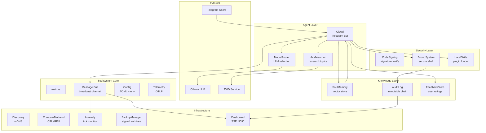
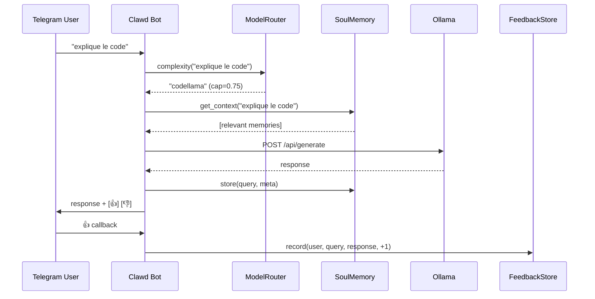

# SoulSystem Architecture Guide v0.5.0

## Overview

SoulSystem is a modular autonomous agent ecosystem in Rust. The Operator Edition provides a unified binary (`soulsystem`) that orchestrates all subsystems through a central message bus.

## Module Map



## Request Lifecycle



## Module Details

### Core Layer
| Module | Path | Role |
|--------|------|------|
| `bus` | `src/bus.rs` | Central broadcast channel (256 capacity). Enum: HnnStatus, SynergyDetection, AvidDiscovery, EvolveOptimization |
| `config` | `src/config.rs` | TOML config + env override (`SOULSYSTEM_*`). Paths: config_dir, data_dir, log_dir |
| `telemetry` | `src/telemetry.rs` | OTLP tracing to `localhost:4317` |
| `main` | `src/main.rs` | Clap CLI (`--dev`, `--mock`). Initializes all modules, spawns dashboard+anomaly in dev mode |

### Knowledge Layer
| Module | Path | Role |
|--------|------|------|
| `soul_memory` | `src/soul_memory.rs` | Vector store. Plugable `Embedder` trait. Default: `SciRustEmbedder` (64-dim deterministic random projection). Fallback: `NGramEmbedder`. Backend: sled or Qdrant. Includes `decay_and_prune` for forgetting. |
| `audit_log` | `src/audit_log.rs` | Immutable chained audit log (sled). SHA-256 hashing, linked entries, `verify_integrity()` |
| `clawd::FeedbackStore` | `src/clawd.rs` | User feedback storage (sled). Records query/response/score(+1/-1) with timestamp |

### Agent Layer
| Module | Path | Role |
|--------|------|------|
| `clawd` | `src/clawd.rs` | Telegram bot. Commands: /veille, /skill, /run. Chat with LLM routing. Feedback buttons |
| `model_router` | `src/model_router.rs` | Complexity heuristic (keywords, length, code indicators). Routes to least-cost capable model |
| `clawd::AvidWatcher` | `src/clawd.rs` | Periodic research topic monitoring. Calls AVID or uses mock results |

### Security Layer
| Module | Path | Role |
|--------|------|------|
| `code_signing` | `src/code_signing.rs` | SHA-256 XOR-based code verification. AuthorizedKeys registry |
| `bound_system` | `src/bound_system.rs` | Secure command execution. Whitelist, bubblewrap sandbox, timeout, audit trail |
| `local_skills` | `src/local_skills.rs` | Plugin loader with signature verification. Builtin echo skill |

### Infrastructure Layer
| Module | Path | Role |
|--------|------|------|
| `discovery` | `src/discovery.rs` | mDNS service discovery on port 42069. Local peer registry |
| `compute_backend` | `src/compute_backend.rs` | CPU/GPU backend detection: CUDA > ROCm > Vulkan > CPU |
| `anomaly` | `src/anomaly.rs` | HNN tick rate anomaly detection (>40% drop, 60s cooldown). Feature-gated `dev` |
| `backup` | `src/backup.rs` | Signed tar.gz backups. SHA-256 hashing, HMAC signatures, verification |
| `dev_dashboard` | `src/dev_dashboard.rs` | SSE dashboard on :9090. Streams: bus, HNN ticks, modules, audit. Feature-gated `dev` |

## Data Flow

```
User Message
    │
    ▼
Clawd.handle_command()
    │
    ├── /veille ──> AvidWatcher.add_topic()
    │                   │
    │                   └── (daily) research() ──> SoulMemory.store(tag="veille")
    │
    ├── /skill ──> BuiltinSkills.execute()
    │
    ├── /run ────> BoundSystem.execute()
    │               │
    │               ├── is_allowed()? ──> bwrap sandbox
    │               └── AuditLog.log()
    │
    └── text ────> ModelRouter.route()
                    │
                    SoulMemory.get_context()
                    │
                    Ollama /api/generate
                    │
                    SoulMemory.store()
                    │
                    Response + feedback buttons
```

## Initialization Order (main.rs)

1. Tracing subscriber setup
2. Parse CLI args
3. Load Settings from `soulsystem.toml`
4. Create directories
5. Bus::new(256)
6. AuditLog::open() + genesis entry
7. SoulMemory::new() (SciRustEmbedder 64-dim)
8. DiscoveryService::new(42069).start()
9. Telemetry init
10. If `--dev`: spawn Dashboard (axum :9090) + AnomalyWatcher
11. Main loop: sleep 60s, count peers

## Backend Selection

```
get_backend()
    ├── nvidia-smi found → CudaBackend
    ├── rocm-smi found  → RocmBackend
    ├── vulkaninfo found → VulkanBackend
    └── fallback → CpuFallback
```
