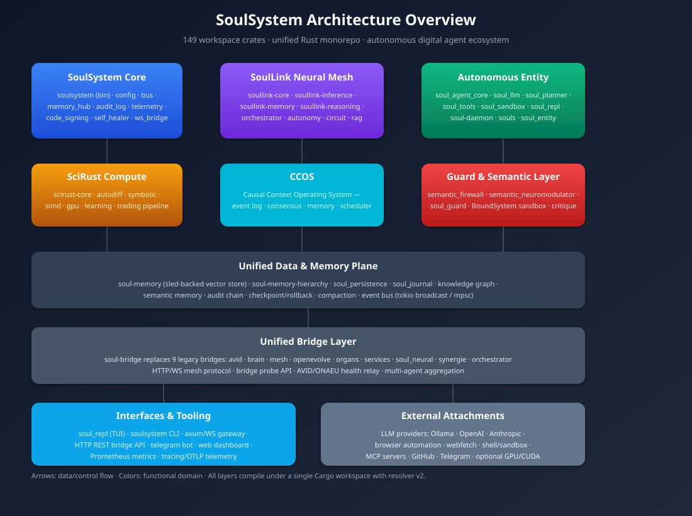

# SoulSystem — Architecture Presentation

> **A unified autonomous-agent operating system in Rust.**
>
> 149 workspace crates · ~740 k LOC · single `cargo check --workspace` build



## 1. What SoulSystem Is

SoulSystem is a **digital-agent ecosystem**: a collection of cooperating Rust crates that lets you run, observe, and evolve autonomous software entities. It is not just a chatbot wrapper. It is an opinionated runtime for **goal-driven agents** that can plan, remember, use tools, self-heal, and collaborate across a neural mesh.

The codebase is intentionally a **monorepo**: every subsystem — brain, memory, tools, scientific compute, causal context, bridges, interfaces — lives in one Cargo workspace so that interfaces stay consistent and the whole stack can be validated in one command.

## 2. Design Principles

| Principle | How it manifests |
|-----------|------------------|
| **Rust everywhere** | No Python runtime dependency. Every crate is Rust 2021, resolver v2, MSRV 1.75+. |
| **Batteries included, layers optional** | You can run `cargo run --bin soulsystem` with defaults, or enable `gpu`, `dev`, `ed25519` features selectively. |
| **Memory is not an afterthought** | Vector store, hierarchical memory, knowledge graph, audit chain, and WAL are first-class crates. |
| **Safety by default** | Destructive tool calls require explicit permission levels; shell execution goes through `BoundSystem` / `soul_sandbox`. |
| **Bridge unification** | One `soul-bridge` crate replaces nine legacy bridge crates, exposing module aliases for backward compatibility. |

## 3. Layered Architecture

### 3.1 Core Runtime (`src/`, `crates/`)

The root binary `soulsystem` coordinates:

- **Configuration** — `soulsystem.toml` + `SOULSYSTEM_*` environment overrides.
- **Bus** — internal tokio broadcast bus (256-msg buffer) for decoupled inter-module messages.
- **Memory Hub** — central access to vector memory, knowledge graph, and episodic storage.
- **Audit Log** — immutable signed hash chain in `/var/log/soulsystem/audit.sled`.
- **Code Signing** — ed25519 verification of any code executed by extensions.
- **Self-Healer** — reacts to defense actions (throttle, emergency save, memory dump, fallback).
- **Telemetry** — tracing + OTLP + Prometheus metrics.
- **WS Bridge** — WebSocket relay for external dashboards.

### 3.2 SoulLink Neural Mesh (`soullink-brain/`)

A Hamiltonian Neural Network-inspired organ system:

| Organ | Responsibility |
|-------|----------------|
| `soullink-core` | HNN engine, Verlet symplectic dynamics. |
| `soullink-inference` | Model loading, routing, TurboQuant KV-cache offloading, MTP (multi-token prediction). |
| `soullink-memory` / `soullink-memory-hierarchy` | Concept graph, working/episodic/semantic layers. |
| `soullink-orchestrator` | Distributed brain coordination via HTTP/WS. |
| `soullink-autonomy` | Dream cycles, metacognition, preservation, afferent/efferent pathways. |
| `soullink-circuit` | Circuit breaker / rate limiting. |
| `soullink-reasoning` | Thought trees, argumentation. |
| `soullink-rag` | Retrieval-augmented generation pipeline. |
| `soullink-senate` | Multi-agent voting/consensus. |

### 3.3 Autonomous Entity (`soul-agent-core/`, `soul-daemon/`, `soul_entity/`, `souls/`)

The agent loop follows the **ReAct pattern**: observe → think → act → evaluate.

Key crates:

- `soul_agent_core` — `AutonomousAgent` with `CognitiveLoop`, `ToolRegistry`, `HierarchicalMemory`, `KnowledgeGraph`, `MetaCognition`, `TrajectoryRecorder`.
- `soul_llm` — multi-provider LLM client (`Ollama`, `OpenAI`, `Anthropic`) with streaming, embeddings, budgets, and a legacy API shim.
- `soul_planner` — goal decomposition, action history, `WorkingMemory` circular buffer.
- `soul_tools` — async, permission-gated tool dispatch (`execute_shell`, `read_file`, `write_file`, ...).
- `soul_sandbox` — `BoundSystem` sandbox for command execution.
- `soul-daemon` — background goal processing with `SubAgentManager`, checkpoint/rollback, and cron-style scheduling.
- `soul_repl` — conversational TUI with streaming output.

### 3.4 Scientific Compute (`scirust-*`)

- `scirust-core` — matrices, SIMD, symbolic calculus, automatic differentiation, pattern memory, equation solver, transformer mini-LLM, embeddings.
- `scirust-autodiff` — forward/reverse-mode autodiff.
- `scirust-symbolic` — expression parsing, simplification, proof helpers.
- `scirust-trading-*` — quantitative trading pipeline.

### 3.5 Causal Context OS — CCOS (`ccos/`)

A recent addition: an event-sourced runtime with:

- causal event graph,
- deterministic replay,
- distributed consensus,
- adversarial testing harness,
- scheduler and workspace model.

CCOS lets SoulSystem reason about **why** the system is in a given state, not only **what** it is.

### 3.6 Guard & Semantic Layer (`semantic_*`, `soul_guard`, `BoundSystem`)

- `semantic_firewall` — blocks outputs close to forbidden concept embeddings.
- `semantic_neuromodulator` — chemical-map neuromodulation for attention/reward shaping.
- `soul_guard` / `BoundSystem` — sandboxed execution, seccomp/bubblewrap.
- `soul_critique` — six-dimension self-critique after each task.

### 3.7 Unified Bridge (`soul-bridge`)

Replaces:

```text
avid-bridge    brain-bridge    mesh-bridge    openevolve-bridge
organs-bridge  services-bridge soul-neural-bridge  synergie-bridge  orchestrator-bridge
```

by module aliases (`soul_bridge::avid`, `soul_bridge::brain`, ...) so historical call sites keep compiling.

### 3.8 Data & Memory Plane

Shared across all layers:

- `soul-memory` — sled-backed vector storage.
- `soul-memory-hierarchy` — working → episodic → semantic consolidation.
- `soul_persistence` — WAL / mmap KV.
- `soul_journal` — append-only journal.
- Knowledge graph inside `soul_agent_core`.
- Event bus inside `soul-eventbus`.

### 3.9 Interfaces & Tooling

- CLI: `soulsystem [--dev|--repl|--daemon]`.
- TUI: `soul_repl`.
- HTTP/WS gateway in `soul_gateway` / `soullink-gateway`.
- Bridge probe API: `POST /api/bridges/probe`.
- Prometheus metrics, tracing-subscriber, optional OTEL exporter.

## 4. Build & Validation

```bash
# Fast workspace check
cargo check --workspace

# Core unit tests
cargo test --lib -p scirust-core -p semantic_firewall \
  -p semantic_neuromodulator -p soul_agent_core \
  -p soul_tools -p soul_planner

# Full validation pipeline
./scripts/validate.sh
```

Current status:

- `cargo check --workspace`: ✅ zero errors.
- Core crate tests: ✅ 97/97 passing.

## 5. Roadmap (selected)

1. Re-enable historical cron scheduler as a dedicated crate or delegate fully to `soul-daemon`.
2. GPU feature completion (`gpu` / `scirust-gpu` / `soul-neural`).
3. Long-running `soullink-inference` turboquant test integration.
4. `souls` binary target cleanup.
5. CCOS integration tests in CI.

## 6. Read More

- [`README.md`](../README.md) — quick start.
- [`STATUS.md`](../STATUS.md) — ecosystem health dashboard.
- [`AUDIT.md`](../AUDIT.md) — autonomy audit and crate inventory.
- [`docs/ARCHITECTURE.md`](./ARCHITECTURE.md) — detailed module docs.
- [`docs/MEMORY_SYSTEM.md`](./MEMORY_SYSTEM.md) — memory design.
- [`docs/SECURITY.md`](./SECURITY.md) — sandbox and signing.
